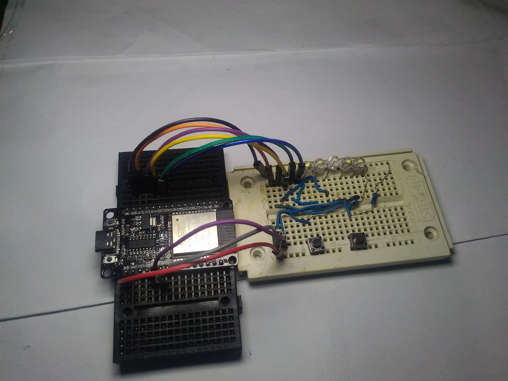
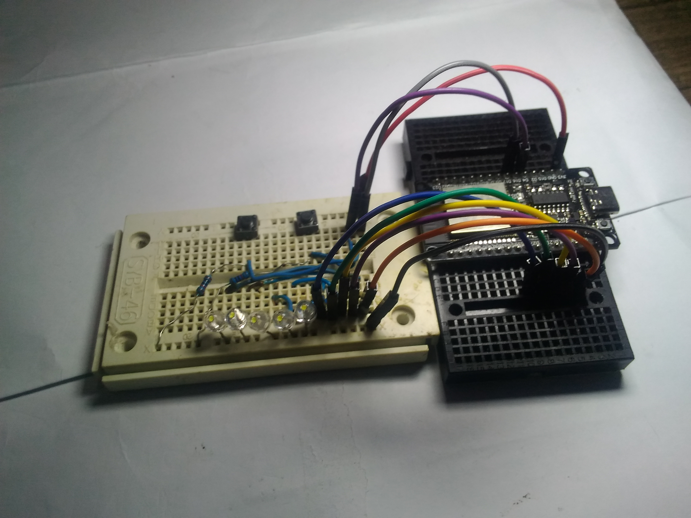
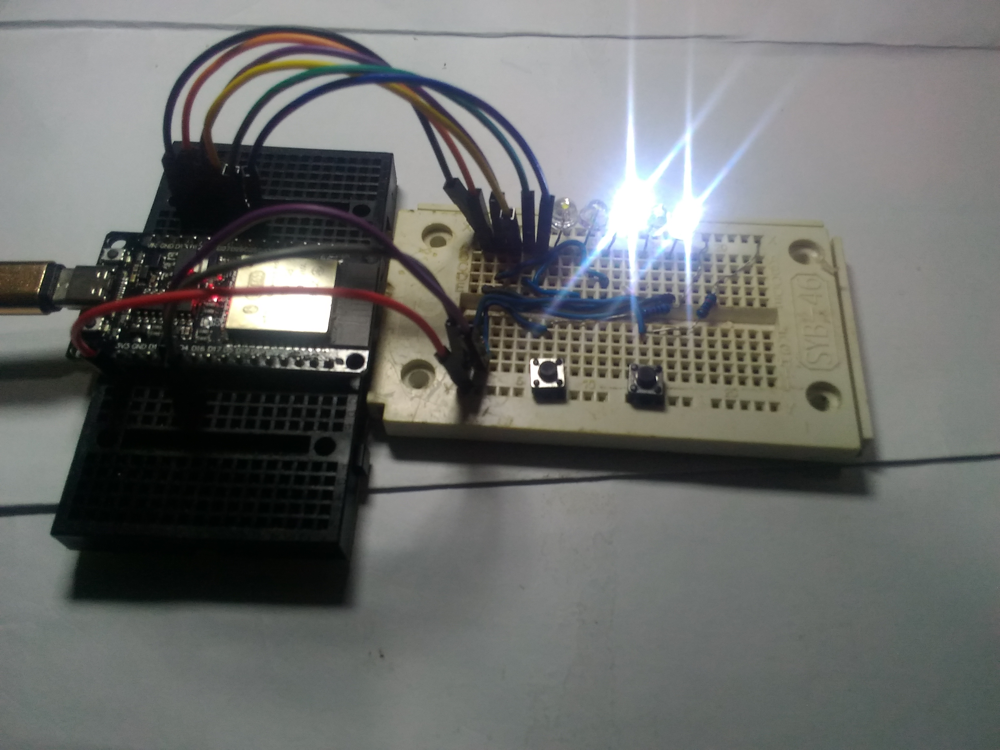
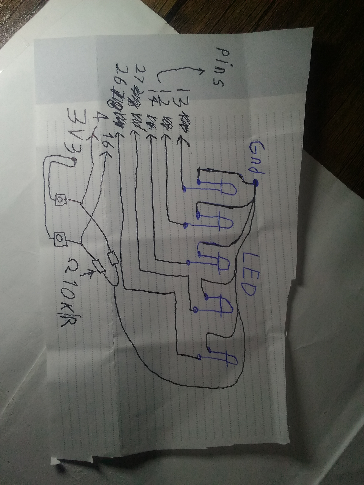

# 5-LED-Snake-Game-for-beginners

## Description

This is a very simple snake game built with only 5 LEDs and 2 push buttons.

I am 13 years old and I made this project to show that even with minimal equipment, anyone can create something fun and learn electronics. I started learning electronics a few months ago with almost nothing — just some old wires and a few LEDs I found. This project is the result of that journey.

The idea is to show that you can make a fun and playable game with almost nothing — just a few basic electronic components. No display, no screen, no complex parts, no expensive modules. Just simple LEDs, buttons, and wires.

How it works:

· Each LED represents a position in the game (like 5 cells in a row)
· One LED is always ON → this is the player
· One LED is BLINKING → this is the food
· You have two buttons: left and right
· By pressing the buttons, you move the player LED left or right
· When the player reaches the blinking LED (food), all LEDs blink quickly to celebrate, and the food moves to a new random position
· The game never ends — you can keep playing forever
· The player cannot go outside the game area (it stops at the edges)

Why I made this:

I made this project for people who:

· Are beginners in electronics and don't know where to start
· Don't have access to many components or can't afford expensive parts
· Want to learn and have fun with simple tools they already have
· Want to see that you don't need expensive parts to build something cool
· Are young and think they can't do big projects — yes you can!
· Live in places where electronic parts are hard to find or expensive

What makes it special:

· Only 5 LEDs and 2 buttons — that's it!
· No LCD, no matrix, no complex wiring, no sensors
· Easy to understand and modify — even for complete beginners
· Works with ESP32, Arduino, or any similar board
· Full code is provided and explained
· Made by a 13-year-old maker who had almost nothing when starting
· The whole project costs less than $8 to build
· You can build it in one evening
· It's a real game — not just a blinking LED tutorial

What I learned making this:

· How to use buttons without delay
· How to make LEDs blink at different rates
· How to prevent the player from going outside the game area
· How to make a simple game loop
· How to write clean code that others can understand
· How to share a project on GitHub
· That you don't need much to create something fun

My message to you:

If you are reading this and thinking about starting electronics, just start. You don't need expensive kits or fancy tools. Use what you have. Ask questions. Fail many times. Get angry. Take a break. Try again. That's exactly what I did. This project failed many times before it worked. And now it's here for you to use, learn from, and maybe even improve.

This project proves that even with minimal equipment and at a young age, you can create a real game and learn a lot about electronics and programming. If I can do it, you can do it too.

## Photos of my robot




## Video of working
*[Video coming soon...]*

## Connection
| from | to | with |
|------|----|------|
| GND | LED GND pins | none |
| 3V3 (or 5V) | button one pin | none |
| GND | button two pin | 10K Ohm resistor |
| GPIO 4 | button one other pin | none |
| GPIO 16 | button two other pin | none |
| GPIO 13 | LED 1 | resistor (optional) |
| GPIO 12 | LED 2 | resistor (optional) |
| GPIO 14 | LED 3 | resistor (optional) |
| GPIO 27 | LED 4 | resistor (optional) |
| GPIO 26 | LED 5 | resistor (optional) |

## Schematic


> [!NOTE]
> If you are using Arduino or other boards that work with 5V pins, please change 3.3V to 5V.

> [!WARNING]
> I am using low-power LEDs. If you are using high-power LEDs, please connect them with appropriate resistors.

> [!TIP]
> If you are using ESP32 or other boards that support built-in pull-up, you can remove the 10K Ohm resistors and replace `INPUT` with `INPUT_PULLUP` in the code.

> [!NOTE]
> If you want to use other pins, you can change them in the code:  
> `ledPins[5] = {13, 12, 14, 27, 26};`  
> `rightPin = 4;`  
> `leftPin = 16;`

## main code
```cpp
// Pin definitions for 5 LEDs
const int ledPins[5] = {13, 12, 14, 27, 26};

// Pin definitions for buttons
const int rightPin = 4;   // Right button pin
const int leftPin = 16;   // Left button pin

// Game variables
int playerPos = 2;        // Player starts at middle LED (index 2)
int foodPos = 0;          // Food starts at position 0

// Button state variables (for detecting button presses)
bool lastRight = HIGH;    // Previous state of right button
bool lastLeft = HIGH;     // Previous state of left button

// Food blinking control
unsigned long lastBlink = 0;  // Stores last time food blinked
bool foodState = true;        // Current state of food LED (ON/OFF)

// Setup function runs once when device starts
void setup() {
  // Set all LED pins as OUTPUT
  for(int i = 0; i < 5; i++) {
    pinMode(ledPins[i], OUTPUT);
  }
  
  // Set button pins as INPUT
  // Note: I'm using INPUT here instead of INPUT_PULLUP
  // If you want to use internal pull-up resistors, change to INPUT_PULLUP
  // With INPUT, you need external pull-up or pull-down resistors
  pinMode(rightPin, INPUT);
  pinMode(leftPin, INPUT);
  
  // Make sure food doesn't start at same position as player
  if(foodPos == playerPos) {
    foodPos = (playerPos + 2) % 5;  // Move food 2 positions ahead
  }
  
  // Turn on LEDs based on initial positions
  updateLEDs();
}

// Main loop runs continuously
void loop() {
  // ===== Food blinking control =====
  // Check if 300ms has passed since last blink
  if(millis() - lastBlink > 300) {
    foodState = !foodState;        // Toggle food state (ON/OFF)
    lastBlink = millis();          // Update last blink time
    updateLEDs();                  // Update LEDs with new state
  }
  
  // ===== Right button check =====
  // Check if right button is pressed (LOW) and wasn't pressed before
  if(digitalRead(rightPin) == LOW && lastRight == HIGH) {
    // Prevent player from moving beyond last LED (position 4)
    if(playerPos < 4) {  
      playerPos++;                 // Move player right
      checkFood();                 // Check if player reached food
      updateLEDs();                // Update LED display
    }
    delay(200);                    // Debounce delay (prevents multiple readings)
  }
  
  // ===== Left button check =====
  // Check if left button is pressed (LOW) and wasn't pressed before
  if(digitalRead(leftPin) == LOW && lastLeft == HIGH) {
    // Prevent player from moving beyond first LED (position 0)
    if(playerPos > 0) {  
      playerPos--;                 // Move player left
      checkFood();                 // Check if player reached food
      updateLEDs();                // Update LED display
    }
    delay(200);                    // Debounce delay
  }
  
  // Save current button states for next loop iteration
  lastRight = digitalRead(rightPin);
  lastLeft = digitalRead(leftPin);
  
  delay(10);                       // Small delay to reduce CPU usage
}

// Function to check if player reached the food
void checkFood() {
  // If player position matches food position
  if(playerPos == foodPos) {
    celebrate();                   // Play celebration animation
    
    // Generate new random food position
    int newFood;
    do {
      newFood = random(0, 5);      // Random position between 0-4
    } while(newFood == playerPos); // Make sure it's not where player is
    
    foodPos = newFood;              // Set new food position
    
    updateLEDs();                   // Update display
  }
}

// Celebration animation when food is eaten
void celebrate() {
  // Blink all LEDs 3 times
  for(int j = 0; j < 3; j++) {
    // Turn all LEDs ON
    for(int i = 0; i < 5; i++) {
      digitalWrite(ledPins[i], HIGH);
    }
    delay(150);                     // Wait 150ms
    
    // Turn all LEDs OFF
    for(int i = 0; i < 5; i++) {
      digitalWrite(ledPins[i], LOW);
    }
    delay(150);                     // Wait 150ms
  }
}

// Function to update all LEDs based on current game state
void updateLEDs() {
  // Turn all LEDs OFF first
  for(int i = 0; i < 5; i++) {
    digitalWrite(ledPins[i], LOW);
  }
  
  // Turn ON the player LED (always ON)
  digitalWrite(ledPins[playerPos], HIGH);
  
  // Turn ON the food LED only if foodState is true (blinking effect)
  if(foodState) {
    digitalWrite(ledPins[foodPos], HIGH);
  }
}
## ❓ FAQ

### Can I use this project without resistors?
Yes! If your board supports built-in pull-up resistors, you can simply change `INPUT` to `INPUT_PULLUP` in the code. This activates the internal resistors inside the chip, so you don't need external 10K resistors. This works on ESP32, Arduino (some pins), and many other boards.

### What kind of board can I use?
You can use almost any board! ESP32, Arduino Uno, Arduino Nano, ESP8266, STM32, and many more. Just make sure to check the pin numbers and voltage (3.3V or 5V) for your specific board.

### Can I use more than 5 LEDs?
Yes, you can expand the game. You'll need to add more LEDs to the circuit, increase the array size in the code, and update the game logic for more positions. But for beginners, 5 LEDs is a perfect start.

### Can I change the game speed?
Absolutely! Find this line in the code: `if(millis() - lastBlink > 300)`. Change the number 300 to make it faster (smaller number) or slower (bigger number). For example, 500 makes it slower, 150 makes it faster.

### How do I know which LED is the player and which is food?
The always-on LED is the player. The blinking LED is the food. This makes it easy to tell them apart even with just 5 LEDs.

### The buttons are too sensitive. What should I do?
The code already has a delay(200) after each button press to prevent multiple reads. If it's still too sensitive, you can increase this number to 250 or 300. If it's not sensitive enough, decrease it.

### Can I add sound to this game?
Yes! You can add a small buzzer to one of the GPIO pins. In the celebrate() function, add code to make a beep sound when food is eaten. You can also add sounds for button presses or game events.

### My game doesn't work. What should I check first?
Check all your wiring connections. Make sure LEDs are connected correctly (long leg to GPIO, short leg to GND). Verify buttons are wired properly. Check that you selected the right board in Arduino IDE. Make sure the code uploaded successfully. Open the Serial Monitor to see if there are any error messages.

### Can I power this with a battery?
Yes! You can use a 3.7V lithium battery, 9V battery with a regulator, or even USB power bank. Just make sure the voltage matches your board requirements.

### Is this project good for learning programming?
Definitely! This project teaches you how to read button inputs, control multiple LEDs, use millis() for timing without blocking the code, create game logic, debounce buttons, and organize your code with functions.

### Can I share my version of this project?
Yes, please do! The license is Creative Commons Zero, so you can use it anywhere, modify it, even claim it as your own. No need to mention me. But if you share, I'd love to see what you made.

### How long does it take to build?
If you have all the parts, you can build it in 30 minutes to 1 hour. Most of the time is spent on wiring and uploading the code. The rest is playing.

### I'm a complete beginner. Can I really do this?
Yes! This project was made specifically for beginners like you. Take it step by step. Gather all parts. Follow the connection table carefully. Copy the code exactly. Upload and test. If it doesn't work, check everything again. Ask for help if needed. You can do it.

### Where can I get help if I'm stuck?
Open an issue in this GitHub repository. Ask in electronics forums like Reddit (r/arduino, r/esp32). Watch YouTube tutorials for beginners. Ask a friend who knows electronics. Message me directly and I'll try to help.

### Can I translate this project to my language?
Yes, please do! If you translate the README or comments in the code, send it to me and I'll add it to the project. This helps more people around the world learn electronics.

### What other projects can I try after this?
After this project, you can try 10 LED snake game, adding a score counter with 7-segment display, making a buzzer sound when food is eaten, creating a two-player version, adding different levels of difficulty, or making it wireless with Bluetooth control.

### Why did you make this project?
I'm 13 years old and I wanted to show that you don't need expensive equipment to learn electronics and have fun. I started with almost nothing, and this project proves that anyone can create something cool with simple parts.

Still have questions? Open an issue in the repository or leave a comment. I'll answer as soon as possible.
```
## 🤝 Contributing

You can help make this project better. Here are some ways to contribute:

### 📝 Improve the documentation
Fix spelling mistakes. Make instructions clearer. Translate to your language. Add more details about the circuit.

### 🔧 Improve the hardware
Make a better schematic. Design a PCB. Find cheaper components. Suggest better wiring.

### 💻 Improve the code
Add new features. Make the code faster. Add comments. Fix bugs. Make it work with more boards.

### 📸 Share your build
Take photos of your version. Record a video. Send them to me. Show how you built it differently.

### 🐛 Report problems
Tell me if something doesn't work. Let me know if instructions are confusing. Report bugs in the code.

### 💡 Suggest new ideas
Tell me what features you want. Suggest improvements. Ask questions.

#### How to send your changes
Fork this repository. Make your changes. Send a Pull Request. I will review and add it.

Or message me directly with your ideas.

You don't need to be an expert. Even testing and reporting helps.

## donate
If you like this project and want to support me, I'm 13 years old and I make projects with limited equipment. Even a small donation helps me buy more parts.
Thank you.


my bitcoin public key: 
```id
0367fe4e52cec4fef59687718bbae91b4b4a23ac4871a362f1ed2dffd288890cad
```
